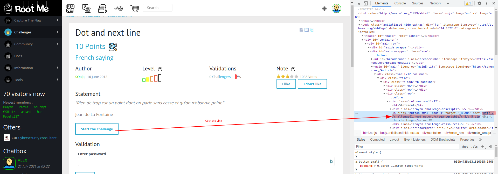
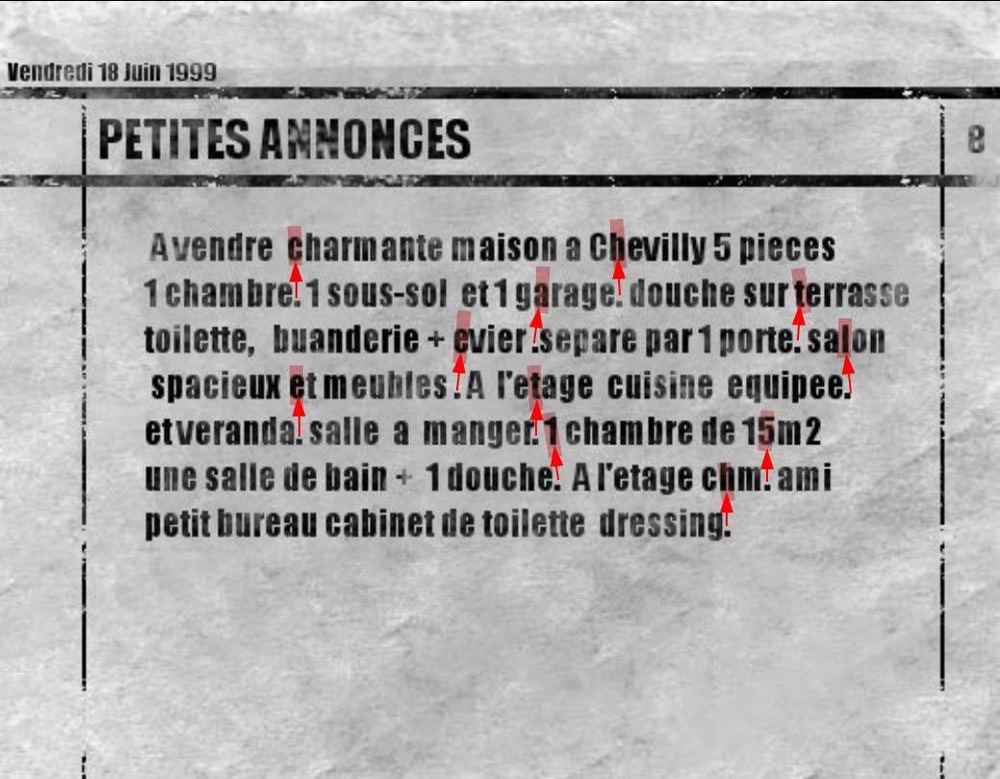

# CTF Challenge

Platform: Root Me  
Type: `Steganography`  
Link: [Dot and next line](https://www.root-me.org/en/Challenges/Steganography/Dot-and-next-line?action_solution=proposer#ancre_solution)  
Hint: The title is already the best hint  
Clue: Palace/Castle  

> I encourage you to find by yourself first!  
[Solution](./passphrase.txt)  

--- 

## Step 1
Download the file by inspecting the `"Start the challenge"` button and just click the link  

  

## Step 2
Extract the `.zip` file and open the image  

## Step 3
Analyze the dots and the next line. Just look at the character above the dot. Each dots symbolized one character  

  